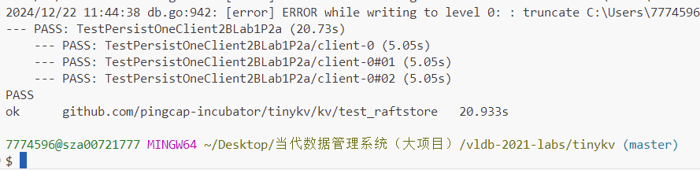

# 第二次大作业: VLDB2021 labs
## 10212140414 盛子骜

---

## 实验目的
实验过程通过相关lab代码，从存储、日志事务引擎出发逐步完善，支持SQL引擎，最终实现一个完整的**支持分布式事务的分布式数据库内核**。需要对于数据库理论、分布式系统有相关基础知识了解。

## 实验环境准备
这个实验是基于**golang**的架构，以及由于我们在windows系统中执行，还需要额外安装**make**（基于mingw32）。
golang是谷歌开发的一种编程语言，拥有接近c语言的性能和丰富的库支持，所以经常用在大型网络服务器和分布式系统中。这两个都通过官网下载安装然后放到环境变量里即可：


在原po中需要加入对应的github classroom获取private repo，以及上传自动评分，我们就把仓库clone下来在本地测试就行了，检查一下配置文件`classroom.yml`是否正常：
```yml
name: GitHub Classroom Workflow

on: [push]

jobs:
  build:
    name: Autograding
    runs-on: [self-hosted,X64]
    steps:
      - uses: actions/checkout@v2
      - uses: PingCAP-QE/setup-go@pingcap
        with:
          go-version: 1.16
      - uses: you06/autograding@go
```
注意到这个实验要求的go版本是1.16，安装的时候不要错了版本。

使用go mod进行依赖包管理，默认配置是下载不下来包的（我这里挂梯子也不行），所以修改go proxy使用代理：
```
export GOPROXY=https://goproxy.io,direct
```

## 实验结构
这个实验的分布式数据库中有几个模块，下面的分类是从原po的README中直接翻译过来的，后面我还会做进一步的解释：
- TinyKV：系统的存储引擎；
- TinyScheduler：用于管理和调度TinyKV集群；
- TinySQL：TinyKV引擎的SQL层。

我们需要完成四个lab，它们分别对应以下几个功能的补全：
- lab1:在TinyKV中实现存储和日志层;
- lab2:在TinyKV中实现事务层;
- lab3:实现Percolator协议;
- lab4:实现SQL执行层;
- lab4-A:实现SQL协议;
- lab4-B:实现更新执行器;
- lab4-C:实现选择和投影执行器。

每个lab都需要我们补全一部分代码，然后make对应的测试，按照顺序去做就可以了。从实验背景中我们了解到它是**基于TiDB和TiKV实现**的，所以在实验开始之前我们必须熟悉一下其架构。

---
## 实验内容
### 关于TiDB和TiKV的背景知识

首先我需要了解tikv和tidb到底是个什么东西。正好礼拜一的课请来了TiDB的老师介绍，我使用**TiDB AI**询问了一下关于tikv和tidb的介绍：


在另一篇资料中可以看到更直观的组成架构：


简单来说，
- **TiKV**是一个**分布式的存储引擎**，是真正的服务实现端；
- **TiDB**是一个**sql层**，本身并不存储数据，只是将SQL查询解析为操作，将实际的数据读取请求转发给底层的存储层TiKV；
- **PD**是整个TiDB集群的**元信息管理模块**，在TiDB和TiKV之间调度数据的分布和流量。

现在我们进入到具体的lab中查看各自的实现。

### Lab1 The Storage And Log Layer
#### 1）TinyKV解构
在tinykv文件夹的README中，可以看到对前两个lab的描述，以及提供了很多非常有用的信息：


实验实现的TinyDB的架构：


我总结一下就是，TinyKV就类似于TiKV，是一个真正的存储层的实现，它依赖TinyScheduler进行集群中心控制（类似PD），而TinySQL就相当于TiDB，是SQL层（后两个lab的作业）。

和TiKV的技术特点类似，TinyKV也**使用了KV键值对的形式存储数据**，也**基于Raft实现分布式**。在后面的实验中我们会逐步接触tinykv中一些关键的组件，先从lab1开始。

#### 2）lab1P0

在lab1中，我们将熟悉整个tinykv框架，以及完善`raftStore`和`storeEngine`的实现。这个raftStore就是用来实现raft共识算法的代码模块，用来**把日志复制到副本中**，当然在这个过程中还需要**保持事务的ACID性**。这里可以参考[TiKV的实现](https://docs.pingcap.com/zh/tidb/stable/tikv-overview)：

- raftStore将处理所有提交日志，并将其复制到不同组中的不同节点，这个组称为Region；
- 在引导阶段之后先只有一个Region，后续这个Region可能会被拆分成更多的Region，不同的Region负责不同的key范围，多Region独立处理客户端请求。

在lab1中为了简化任务，首先考虑的是**单机（standalone）的存储引擎**，后续再设置raft接口啥的，这就是lab1P0的任务，补全`kv/storage/standalone_storage/standalone_storage.go`中的代码：
```go
func (s *StandAloneStorage) Reader(ctx *kvrpcpb.Context) (storage.StorageReader, error) {
	// YOUR CODE HERE (lab1).
	panic("not implemented yet")
	return nil, nil
}

func (s *StandAloneStorage) Write(ctx *kvrpcpb.Context, batch []storage.Modify) error {
	// YOUR CODE HERE (lab1).
	// Try to check the definition of `storage.Modify` and txn interface of `badger`.
	// As the column family is not supported by `badger`, a wrapper is used to simulate it.
	panic("not implemented yet")
	return nil
}
```

在`storage.go`中介绍了storage接口中定义的四个方法，其中就包括我们要实现的write和reader：
- reader有一个参数ctx，这是上下文信息，返回值是读取存储数据的实例StorageReader；
- write有两个参数ctx和batch，batch是一组修改类型，表示批量写入的操作，是`modify`类型的，在`storage.Modify`有定义。

实验书里说存储引擎是**badger**，叫我们去它的代码仓库查找通用方法，还特别提到可以使用badger提供的**txn（事务）功能**和相关读写接口，以及使用**BadgerReader方法**。

**badger是什么？**
badger是一个高性能的嵌入式Key-Value数据库，能够提供全局一致性，提供两种事务处理模式（读和写）。

在`standalone_storage.go`文件后面有定义返回badger对象的函数NewBadgerReader（）：
```go
type BadgerReader struct {
	txn *badger.Txn
}

func NewBadgerReader(txn *badger.Txn) *BadgerReader {
	return &BadgerReader{txn}
}
```
可以看到，结构体`BadgerReader`封装了badger数据库的事务处理实例`txn`，它的构造函数`NewBadgerReader`能够返回封装后的*BadgerReader实例，然后我们就可以使用这个返回后的BadgerReader执行后续具体操作。那么Txn该如何构造呢？我在badger的源码`txn.go`中找到了方法：


这里显示使用NewTransaction()可以创建一个新事务，如果是只读事务需要将update设置为false，那么Reader函数的实现就很明了了：
```go
func (s *StandAloneStorage) Reader(ctx *kvrpcpb.Context) (storage.StorageReader, error) {
	// YOUR CODE HERE (lab1).
	return NewBadgerReader(s.db.NewTransaction(false)), nil
}
```
这样Reader就提供了一个只读事务返回给调用方读取数据。

然后是Write函数，涉及到写会复杂一些，既然是写就需要用到badger中定义的写相关操作，这也是在badger源码的`bench.go`存放的。writebatch是一个用于批量操作的封装工具，它可以将多条数据修改操作缓存起来，最后统一写入数据库：


有关engines_util的应用也都放在`tinykv\kv\util\engine_util\util.go`和`write_batch.go`中，其中**SetCF函数执行插入/更新操作，DeleteCF执行删除**。前面提到，我们的batch中的操作是modify类型的，我们去看看modify中是如何定义的：
```go
func (m *Modify) Cf() string {
	switch m.Data.(type) {
	case Put:
		return m.Data.(Put).Cf
	case Delete:
		return m.Data.(Delete).Cf
	}
	return ""
}
```
对应writebatch里的SetCF和DeleteCF函数：
```go
func (wb *WriteBatch) SetCF(cf string, key, val []byte) 
……
func (wb *WriteBatch) DeleteCF(cf string, key []byte) 
……
```
看来Put和Delete分别表示插入\更新和删除，那我们的write就可以这样写，首先创建一个writebatch对象，然后遍历batch中的所有modify操作，根据其具体类型执行删除或者插入\更新操作，最后把writebatch中的操作写入数据库：
```go
func (s *StandAloneStorage) Write(ctx *kvrpcpb.Context, batch []storage.Modify) error {
	// YOUR CODE HERE (lab1).
	// Try to check the definition of `storage.Modify` and txn interface of `badger`.
	// As the column family is not supported by `badger`, a wrapper is used to simulate it.
	writeBatch := new(engine_util.WriteBatch)

	for _, mod := range batch {
		switch mod.Data.(type) {
		case storage.Put:
			writeBatch.SetCF(mod.Cf(), mod.Key(), mod.Value())
		case storage.Delete:
			writeBatch.DeleteCF(mod.Cf(), mod.Key())
		}
	}

	return writeBatch.WriteToDB(s.db)
}
```

**lab1P0的运行结果：**


这里的参数错误是因为BadgerDB使用的文件操作可能与Windows的路径分隔符或文件锁机制冲突导致的，可以忽略，可以看到所有测试都pass了。（由于该实验对内存容量要求比较高，故没有在虚拟机上开展）

#### 3）raftstore功能补全(P1-P4)
然后我们要继续实现`raftstore`的核心接口。P0中实现的standalone是没有考虑Log层的，直接让存储引擎处理读写请求，现在我们要加上log处理，所以要多加一个badger来持久化raft日志。raftstore的工作流程如下：


拆分开之后，可以把这个流程总结为两步：
- 第一步是**日志一致性阶段（The log consensus phase）**，客户端请求会携带回调函数被发送到路由器，**raftWorker**使用对应的peerMsgHandler处理这些请求；
- 第二步是**日志应用阶段（The log apply phase）**，当日志被Raft组提交后，应用请求会被发送到应用路由器（apply router）。**applyWorker**处理这些应用请求，最终触发回调函数。只有在回调完成后，才能将结果响应给客户端。

这里面有一些重要的组件定义：
- **RawNode**：是raft实例的一个封装，提供三个接口Step、Ready和Advance，其中实际要发送的消息和要持久化的日志会通过Ready结构返回；
- **Ready**：raft实例的输出，让上层继续做进一步处理；
- **Region**：一个raft组；
- **Peer**：节点，默认情况下一个Region里面有3个Peer，每个Peer里面放着一个RawNode；
- **raftWorker**：处理路由到不同Region的Peer的所有客户端请求；
- **peeMsgHandler**：处理特定Leader peer的客户端请求的代理；
- **applyWorker**：见上面第二步的介绍。

下面我们就开始补全缺失的代码。首先是`peer_Msg_handler.go`中的`proposeRaftCommand`方法：
```go
func (d *peerMsgHandler) proposeRaftCommand(msg *raft_cmdpb.RaftCmdRequest, cb *message.Callback) {
	panic("not implemented yet")
	// YOUR CODE HERE (lab1).
	// Hint1: do `preProposeRaftCommand` check for the command, if the check fails, need to execute the
	// callback function and return the error results. `ErrResp` is useful to generate error response.

	// Hint2: Check if peer is stopped already, if so notify the callback that the region is removed, check
	// the `destroy` function for related utilities. `NotifyReqRegionRemoved` is useful to generate error response.

	// Hint3: Bind the possible response with term then do the real requests propose using the `Propose` function.
	// Note:
	// The peer that is being checked is a leader. It might step down to be a follower later. It
	// doesn't matter whether the peer is a leader or not. If it's not a leader, the proposing
	// command log entry can't be committed. There are some useful information in the `ctx` of the `peerMsgHandler`.
}
```
这个函数有两个参数，`raft_cmdpb.RaftCmdRequest`应该是客户端发送的raft命令的信息，`message.Callback`是一个回调函数对象。

可以看到要完成三个逻辑，首先要执行`preProposeRaftCommand`检查命令是否合法，这个函数就在上面，返回值是一个error类型，所以直接调用就行了，然后使用`ErrResp`方法整合错误信息：
```go
hint1:
	err := d.preProposeRaftCommand(msg)
	if err != nil {
		cb.Done(ErrResp(err))
		return
	}
```
然后再检查这个peer节点是不是active的，如果已经stop了，需要通知回调函数该节点已被移除，并且使用`destroy`方法移除该节点。

`destroy`方法的用法可以在上文中找到，然后这里让我们用`NotifyReqRegionRemoved`方法整合错误信息，这个函数定义在`peer.go`中，参数是`(regionId uint64, cb *message.Callback)`：
```go
func NotifyReqRegionRemoved(regionId uint64, cb *message.Callback) {
	regionNotFound := &util.ErrRegionNotFound{RegionId: regionId}
	resp := ErrResp(regionNotFound)
	cb.Done(resp)
}

func (d *peerMsgHandler) destroyPeer() {
	log.Info(fmt.Sprintf("%s starts destroy", d.Tag))
	regionID := d.regionId
	// We can't destroy a peer which is applying snapshot.
	meta := d.ctx.storeMeta
	meta.Lock()
	defer meta.Unlock()
	isInitialized := d.isInitialized()
	if err := d.Destroy(d.ctx.engine, false); err != nil {
		………………
	}
```
destroy之后调用NotifyReqRegionRemoved生成错误信息：
```go
hint2:
	if d.stopped {
		if err = d.Destroy(d.ctx.engine, false); err != nil {
			NotifyReqRegionRemoved(d.regionId, cb)
			return
		}
	}
```
最后要使用`propose`提交命令到raft集群中，propose方法定义在`peer.go`中：
```go
func (p *peer) Propose(kv *badger.DB, cfg *config.Config, cb *message.Callback, req *raft_cmdpb.RaftCmdRequest, errResp *raft_cmdpb.RaftCmdResponse)
```
它的参数分别是raft的存储引擎（在我们这里就是badger.DB）、参数配置对象、响应对象以及错误响应，也是对应着调用即可，如果出错就return:
```go
	errResp := newCmdResp()
	if !d.Propose(d.ctx.engine.Raft, d.ctx.cfg, cb, msg, errResp) {
		return
	}
```
完整的proposeRaftCommand函数实现：
```go
func (d *peerMsgHandler) proposeRaftCommand(msg *raft_cmdpb.RaftCmdRequest, cb *message.Callback) {
	err := d.preProposeRaftCommand(msg)
	if err != nil {
		cb.Done(ErrResp(err))
		return
	}
	if d.stopped {
		if err = d.Destroy(d.ctx.engine, false); err != nil {
			NotifyReqRegionRemoved(d.regionId, cb)
			return
		}
	}
	errResp := newCmdResp()
	if !d.Propose(d.ctx.engine.Raft, d.ctx.cfg, cb, msg, errResp) {
		return
	}
}
```

接下来要补全`peer.go`中`HandleRaftReady`方法：
```go
func (p *peer) HandleRaftReady(msgs []message.Msg, pdScheduler chan<- worker.Task, trans Transport) (*ApplySnapResult, []message.Msg) {
	if p.stopped {
		return nil, msgs
	}

	if p.HasPendingSnapshot() && !p.ReadyToHandlePendingSnap() {
		log.Debug(fmt.Sprintf("%v [apply_id: %v, last_applying_idx: %v] is not ready to apply snapshot.", p.Tag, p.peerStorage.AppliedIndex(), p.LastApplyingIdx))
		return nil, msgs
	}

	// YOUR CODE HERE (lab1). There are some missing code pars marked with Hint above, try to finish them.
	// Hint1: check if there's ready to be processed, if no return directly.
	panic("not implemented yet")

	// Start to handle the raft ready.
	log.Debug(fmt.Sprintf("%v handle raft ready", p.Tag))

	ready := p.RaftGroup.Ready()
	// TODO: workaround for:
	//   in kvproto/eraftpb, we use *SnapshotMetadata
	//   but in etcd, they use SnapshotMetadata
	if ready.Snapshot.GetMetadata() == nil {
		ready.Snapshot.Metadata = &eraftpb.SnapshotMetadata{}
	}

	// The leader can write to disk and replicate to the followers concurrently
	// For more details, check raft thesis 10.2.1.
	if p.IsLeader() {
		p.Send(trans, ready.Messages)
		ready.Messages = ready.Messages[:0]
	}
	ss := ready.SoftState
	if ss != nil && ss.RaftState == raft.StateLeader {
		p.HeartbeatScheduler(pdScheduler)
	}

	applySnapResult, err := p.peerStorage.SaveReadyState(&ready)
	if err != nil {
		panic(fmt.Sprintf("failed to handle raft ready, error: %v", err))
	}
	if !p.IsLeader() {
		p.Send(trans, ready.Messages)
	}

	if applySnapResult != nil {
		/// Register self to applyMsgs so that the peer is then usable.
		msgs = append(msgs, message.NewPeerMsg(message.MsgTypeApplyRefresh, p.regionId, &MsgApplyRefresh{
			id:     p.PeerId(),
			term:   p.Term(),
			region: p.Region(),
		}))

		// Snapshot's metadata has been applied.
		p.LastApplyingIdx = p.peerStorage.truncatedIndex()
	} else {
		committedEntries := ready.CommittedEntries
		ready.CommittedEntries = nil
		l := len(committedEntries)
		if l > 0 {
			p.LastApplyingIdx = committedEntries[l-1].Index
			msgs = append(msgs, message.Msg{Type: message.MsgTypeApplyCommitted, Data: &MsgApplyCommitted{
				regionId: p.regionId,
				term:     p.Term(),
				entries:  committedEntries,
			}, RegionID: p.regionId})
		}
	}

	// YOUR CODE HERE (lab1). There are some missing code pars marked with Hint above, try to finish them.
	// Hint2: Try to advance the states in the raft group of this peer after processing the raft ready.
	//        Check about the Advance method in for the raft group.
	panic("not implemented yet")

	return applySnapResult, msgs
}
```
我们按顺序解析一下这个方法在做什么，首先这个函数有三个参数msgs、pdScheduler、trans，顾名思义一个是传递的消息、一个是和PD通信的调度器，还有一个trans应该也是和通信相关的，接下来逐段分析源码。前面全是合法性检查，分别需要检查当前peer活动状态、应用快照是否准备好以及是否有ready对象需要处理（我们需要补充的hint1）：
```go
hint1:
	if !p.RaftGroup.HasReady() {
		return nil, msgs
	}
```
检查完之后从raftgroup中获取ready对象，然后发送消息，根据当前peer是不是Leader处理PD调度，持久化ready状态、处理快照应用的结果等等。最后要补充的是hint2，让我们使用`advance`方法通知raft状态机当前ready对象已经处理好了，这个advance方法定义在`rawnode.go`中，就是更新一些raft中的状态信息：
```go
// Advance notifies the RawNode that the application has applied and saved progress in the
// last Ready results.
func (rn *RawNode) Advance(rd Ready) {
	if rd.SoftState != nil {
		rn.prevSoftSt = rd.SoftState
	}
	if !IsEmptyHardState(rd.HardState) {
		rn.prevHardSt = rd.HardState
	}
	if rn.prevHardSt.Commit != 0 {
		rn.Raft.RaftLog.appliedTo(rn.prevHardSt.Commit)
	}
	if len(rd.Entries) > 0 {
		e := rd.Entries[len(rd.Entries)-1]
		rn.Raft.RaftLog.stableTo(e.Index, e.Term)
	}
	if !IsEmptySnap(&rd.Snapshot) {
		rn.Raft.RaftLog.stableSnapTo(rd.Snapshot.Metadata.Index)
	}
}

hint2:
p.RaftGroup.Advance(ready)
```
补全的`HandleRaftReady`方法（为了限制篇幅后面如果太长的函数就不放完整源码了，中间无需修改的部分省略）：
```go
func (p *peer) HandleRaftReady(msgs []message.Msg, pdScheduler chan<- worker.Task, trans Transport) (*ApplySnapResult, []message.Msg) {
	……
	// YOUR CODE HERE (lab1). There are some missing code pars marked with `Hint` above, try to finish them.
	// Hint1: check if there's ready to be processed, if no return directly.
	if !p.RaftGroup.HasReady() {
		return nil, msgs
	}
	……
	// YOUR CODE HERE (lab1). There are some missing code pars marked with `Hint` above, try to finish them.
	// Hint2: Try to advance the states in the raft group of this peer after processing the raft ready.
	//        Check about the `Advance` method in for the raft group.
	p.RaftGroup.Advance(ready)

	return applySnapResult, msgs
}
```
接下来是`peer_storage.go`中的`SaveReadyState`方法，是状态和日志持久化的核心部分：
```go
func (ps *PeerStorage) SaveReadyState(ready *raft.Ready) (*ApplySnapResult, error) {
	kvWB, raftWB := new(engine_util.WriteBatch), new(engine_util.WriteBatch)
	prevRaftState := ps.raftState
	var applyRes *ApplySnapResult = nil
	var err error
	if !raft.IsEmptySnap(&ready.Snapshot) {
		applyRes, err = ps.ApplySnapshot(&ready.Snapshot, kvWB, raftWB)
		if err != nil {
			return nil, err
		}
	}
	panic("not implemented yet")
	// YOUR CODE HERE (lab1).
	// Hint: the outputs of the raft ready are: snapshot, entries, states, try to process
	//       them correctly. Note the snapshot apply may need the kv engine while others will
	//       always use the raft engine.
	if len(ready.Entries) != 0 {
		// Hint1: Process entries if it's not empty.
	}

	// Last index is 0 means the peer is created from raft message
	// and has not applied snapshot yet, so skip persistent hard state.
	if ps.raftState.LastIndex > 0 {
		// Hint2: Handle the hard state if it is NOT empty.

	}

	if !proto.Equal(&prevRaftState, &ps.raftState) {
		raftWB.SetMeta(meta.RaftStateKey(ps.region.GetId()), &ps.raftState)
	}

	kvWB.MustWriteToDB(ps.Engines.Kv)
	raftWB.MustWriteToDB(ps.Engines.Raft)
	return applyRes, nil
}
```
这个函数会把raft的ready状态持久化到存储中，分别有快照、日志条目、hardstate等。hint1和hint2分别要我们补全**日志和hardstate的处理**，我们可以仿照它提供的快照处理的源码去写：
```go
snap processing:
	if !raft.IsEmptySnap(&ready.Snapshot) {
		applyRes, err = ps.ApplySnapshot(&ready.Snapshot, kvWB, raftWB)
		if err != nil {
			return nil, err
		}
	}
hint1:
	if len(ready.Entries) != 0 {
		// Hint1: Process entries if it's not empty.
		err := ps.Append(ready.Entries, raftWB)
		if err != nil {
			return nil, err
		}
	}
hint2:
	if ps.raftState.LastIndex > 0 {
		// Hint2: Handle the hard state if it is NOT empty.
		if !raft.IsEmptyHardState(ready.HardState) {
			ps.raftState.HardState = &ready.HardState
	}
	}
```
hint2很好理解，如果ready中有新的hardstate就需要更新到当前ps的状态里面去，hint1中需要用到`append`方法，这个方法可以一次性批量将日志条目写入到raft引擎中（raftwb），不过这个方法也是需要我们手动补全的，也在同一个文件中：
```go
func (ps *PeerStorage) Append(entries []eraftpb.Entry, raftWB *engine_util.WriteBatch) error {
	log.Debug(fmt.Sprintf("%s append %d entries", ps.Tag, len(entries)))
	prevLastIndex := ps.raftState.LastIndex
	if len(entries) == 0 {
		return nil
	}
	lastEntry := entries[len(entries)-1]
	lastIndex := lastEntry.Index
	lastTerm := lastEntry.Term
	panic("not implemented yet")
	// YOUR CODE HERE (lab1).
	for _, entry := range entries {
		// Hint1: in the raft write batch, the log key could be generated by `meta.RaftLogKey`.
		//       Also the `LastIndex` and `LastTerm` raft states should be updated after the `Append`.
		//       Use the input `raftWB` to save the append results, do check if the input `entries` are empty.
		//       Note the raft logs are stored as the `meta` type key-value pairs, so the `RaftLogKey` and `SetMeta`
		//       functions could be useful.
		log.Debug(fmt.Sprintf("entry=%v", entry))
	}

	for i := lastIndex + 1; i <= prevLastIndex; i++ {
		// Hint2: As the to be append logs may conflict with the old ones, try to delete the left
		//       old ones whose entry indexes are greater than the last to be append entry.
		//       Delete these previously appended log entries which will never be committed.
	}

	ps.raftState.LastIndex = lastIndex
	ps.raftState.LastTerm = lastTerm
	return nil
}
```
hint1要求我们追加日志条目，提示说日志是由`meta`键值对形式存储的，让我们使用`RaftLogKey` 和 `SetMeta` 函数生成并存储到writebatch中，循环遍历每个日志条目，然后执行生成键值对和存储的操作即可，写完之后记得更新最新的日志索引`LastIndex`和日志任期`LastTerm`；
hint2则是补全日志可能发生冲突的逻辑，如果新追加的日志与之前存储的日志冲突，则需要删除冲突之后的所有日志条目，逻辑已经在给好的循环中写好了，我们只要添加删除命令：
```go
hint1:
	for _, entry := range entries {
		err := raftWB.SetMeta(meta.RaftLogKey(ps.region.Id, entry.Index), &entry)
		if err != nil {
			return err
		}
		log.Debug(fmt.Sprintf("entry=%v", entry))
	}
hint2:
	for i := lastIndex + 1; i <= prevLastIndex; i++ {
		raftWB.DeleteMeta(meta.RaftLogKey(ps.region.Id, i))
	}
```
至此lab1的所有代码都已经补好了。

#### 4）test通过情况
测试项lab1P1a-lab1P3a都能正常运行:





但是到P3b时就开始报错了，显示无法正常生成快照（原因是由于进程被占用某个临时文件无法被重命名），即便删除所有临时文件之后仍然无法继续:


错误信息提示错误发生在`runner.(*snapContext).handleGen`中，这是源码中快照生成的逻辑部分，并不是需要我们修改的方法，看来不是我们补全的代码出问题了，应该是**windows系统的某种文件访问冲突**。稍后我又尝试了重启和删除整个`Local/temp`文件夹，均无法解决，而且我的电脑也并没有运行杀毒软件等程序，无奈之下我决定把项目移植到Linux虚拟机中试一试。
又经过一番配置环境后，测试成功通过了，而且速度也并不是很慢：


接下来是P4a和P4b：


至此Lab1终于做完了。

---
### Lab2 The Transaction Layer
#### 1）Transaction层解构
回顾一下tinykv的实现架构，在lab1中我们完成了raft存储引擎和日志引擎，lab2中则要实现分布式事务处理层**Transaction**。


在lab2的指导文档中为我们介绍了事务层的工作机制，它依赖于一个`percolator`渗滤器协议（ps:这里的percolator是在存储引擎中的，处理具体key的事务逻辑，是**存储引擎内部处理事务逻辑**，区别于lab3中的percolator）：
当用户在操作一串文件时发生了什么呢？首先是把他要执行的操作发送到tinysql服务器，服务器解析并由kv层执行了这些操作，这时一行行的数据就变成了一个个键值对。这时，不同的key存放在不同的`Region`中，我们必须保证**提交过程要么全部同步要么全都不做**。

在这些所有的key中，有一个**主密钥**决定了该事务状态，密钥提交过程分为两步：
- **Prewrite Phase（预写阶段）**：所有的key先准备好，然后写到不同Region的服务器中，其`Prewrite Lock`将被放入存储引擎中每个key的`lock column family`中，任何一个key的预写失败了提交过程就会失败；
- **Commit Phase（提交阶段）**：所有key都预写好了，就从主key开始提交，提交的方法是把每个key的一个`Write Lock`放到存储引擎的`Write column family`中，然后把它的`Prewrite Lock`解锁，主键之外的其他key在后台异步提交。

崩溃时的恢复依赖于回滚记录的设置，当然，既然是锁也不可避免会发生两个操作同时抢占的问题，这些细节在lab2的实现中会体现出来，下面我们就正式开始lab2的实验吧。写到这里我发现篇幅实在是太大了，后面会尽量减少一些不重要的解释并优化行文逻辑。
#### 2）lab2P1-P3
首先在`kv/transaction/commands/get.go`补全KvGet，这个方法是**获取特定key的value**的。
我们需要补充两个hint，一是检查锁的存在和可见性（是否合法），二是搜索write记录并获取提交的值。为了节省篇幅从这里开始我就直接附上补全的代码了：
```go
func (g *Get) Read(txn *mvcc.RoTxn) (interface{}, [][]byte, error) {
	key := g.request.Key
	log.Debug("read key", zap.Uint64("start_ts", txn.StartTS),
		zap.String("key", hex.EncodeToString(key)))
	response := new(kvrpcpb.GetResponse)

	
	// YOUR CODE HERE (lab2).
	// Check for locks and their visibilities.
	// Hint: Check the interfaces provided by `mvcc.RoTxn`.
	lock, err := txn.GetLock(key)
	if err != nil {
		return response, nil, err
	}

	if lock != nil && txn.StartTS >= lock.Ts {
		response.Error = &kvrpcpb.KeyError{
			Locked: &kvrpcpb.LockInfo{
				PrimaryLock: lock.Primary,
				LockVersion: lock.Ts,
				Key:         key,
				LockTtl:     lock.Ttl,
			},
		}
		return response, nil, nil
	}
	// YOUR CODE HERE (lab2).
	// Search writes for a committed value, set results in the response.
	// Hint: Check the interfaces provided by `mvcc.RoTxn`.
	value, err := txn.GetValue(key)
	if err != nil {
		return response, nil, err
	}
	if value == nil {
		response.NotFound = true
	}

	response.Value = value
	return response, nil, nil
}
```
- 锁的可见性取决于上锁的时间，当前事务的`StartTS`（开始时间戳）如果比锁的TS要大，说明这个锁是更早的事务创建的，这个锁对当前事务可见需要进行错误处理，把锁的信息写回去；
- 使用`txn.GetValue(key) `方法获取key的最终提交值。

接下来补全`Prewrite`和`Commit`方法，首先是prewrite，这里面需要补全函数`prewriteMutation`，它将单个操作应用到事务中:
```go
func (p *Prewrite) prewriteMutation(txn *mvcc.MvccTxn, mut *kvrpcpb.Mutation) (*kvrpcpb.KeyError, error) {
	key := mut.Key
	log.Debug("prewrite key", zap.Uint64("start_ts", txn.StartTS),
		zap.String("key", hex.EncodeToString(key)))
	// YOUR CODE HERE (lab2).
	// Check for write conflicts.
	// Hint: Check the interafaces provided by `mvcc.MvccTxn`. The error type `kvrpcpb.WriteConflict` is used
	//		 denote to write conflict error, try to set error information properly in the `kvrpcpb.KeyError`
	//		 response.
	writeRec, writeTs, err := txn.MostRecentWrite(key)
	if err != nil {
		return nil, err
	}

	if writeRec != nil && txn.StartTS <= writeTs {
		keyErr := &kvrpcpb.KeyError{
			Conflict: &kvrpcpb.WriteConflict{
				StartTs:    txn.StartTS,
				ConflictTs: writeTs,
				Key:        key,
				Primary:    p.request.PrimaryLock,
			},
		}
		return keyErr, nil
	}
	// YOUR CODE HERE (lab2).
	// Check if key is locked. Report key is locked error if lock does exist, note the key could be locked
	// by this transaction already and the current prewrite request is stale.
	lock, err := txn.GetLock(key)
	if err != nil {
		return nil, err
	}

	if lock != nil && txn.StartTS != lock.Ts {
		lockedError := &kvrpcpb.KeyError{
			Locked: &kvrpcpb.LockInfo{
				PrimaryLock: lock.Primary,
				LockVersion: lock.Ts,
				Key:         key,
				LockTtl:     lock.Ttl,
			},
		}
		return lockedError, nil
	}
	// YOUR CODE HERE (lab2).
	// Write a lock and value.
	// Hint: Check the interfaces provided by `mvccTxn.Txn`.
	var writeKind mvcc.WriteKind

	switch mut.Op {
	case kvrpcpb.Op_Put:
		writeKind = mvcc.WriteKindPut
	case kvrpcpb.Op_Del:
		writeKind = mvcc.WriteKindDelete
	case kvrpcpb.Op_Rollback:
		writeKind = mvcc.WriteKindRollback
	}

	newLock := &mvcc.Lock{
		Primary: p.request.PrimaryLock,
		Ts:      txn.StartTS,
		Ttl:     p.request.LockTtl,
		Kind:    writeKind,
	}
	txn.PutLock(key, newLock)
	txn.PutValue(key, mut.Value)

	return nil, nil
}
```
hint1：要检查write操作合法性，和上锁一样，写操作不能在事务开始之前就发生了，即`WriteTS`要小于事务的`StartTs`；
hint2：检查是否能正常获取锁，如果锁的ID`LockTS`不等于当前事务`StartTS`，说明这个锁现在被其他事务占用了，必须等待锁释放，返回错误消息；
hint3：如果合法性检查都通过了，则判断操作类型（put/del/rollback），然后设置新锁并写入value。

`Commit.go`中有两个函数需要补全，一是`PrepareWrites`，还是时间戳合法性检查就不再赘述了：
```go
func (c *Commit) PrepareWrites(txn *mvcc.MvccTxn) (interface{}, error) {
	commitTs := c.request.CommitVersion
	// YOUR CODE HERE (lab2).
	// Check if the commitTs is invalid, the commitTs must be greater than the transaction startTs. If not
	// report unexpected error.
	if commitTs <= txn.StartTS {
		return nil, &raft_storage.RegionError{}
	}
	…………
}
```
二是`commitKey`，首先还是要检查合法性，如果这个键压根就没上锁或者锁被另一个事务获取了，需要判断出现了什么异常情况。我们先使用`txn.CurrentWrite()`方法获取当前key最近的write记录：
- 如果被回滚过说明无法继续操作了，提交相关错误信息；如果是其他情况，比如是已经提交过了，那就可以继续操作；
- 如果没找到记录说明这个key既没上锁也没写记录，返回错误。

然后就是构造我们这个事务的写记录，使用`txn.PutWrite()`方法提交，最后解锁这个key。这个倒是不用我们写。
```go
func commitKey(key []byte, commitTs uint64, txn *mvcc.MvccTxn, response interface{}) (interface{}, error) {
	lock, err := txn.GetLock(key)
	if err != nil {
		return nil, err
	}

	// If there is no correspond lock for this transaction.
	log.Debug("commitKey", zap.Uint64("startTS", txn.StartTS),
		zap.Uint64("commitTs", commitTs),
		zap.String("key", hex.EncodeToString(key)))
	if lock == nil || lock.Ts != txn.StartTS {
		// YOUR CODE HERE (lab2).
		// Key is locked by a different transaction, or there is no lock on the key. It's needed to
		// check the commit/rollback record for this key, if nothing is found report lock not found
		// error. Also the commit request could be stale that it's already committed or rolled back.
		existWrite, _, _ := txn.CurrentWrite(key)
		if existWrite != nil {
			if existWrite.Kind == mvcc.WriteKindRollback {
				respValue := reflect.ValueOf(response)
				keyError := &kvrpcpb.KeyError{Retryable: fmt.Sprintf("key %v was rolled back", key)}
				reflect.Indirect(respValue).FieldByName("Error").Set(reflect.ValueOf(keyError))
				return response, nil
			}
			return nil, nil
		}
		respValue := reflect.ValueOf(response)
		keyError := &kvrpcpb.KeyError{Retryable: fmt.Sprintf("lock not found for key %v", key)}
		reflect.Indirect(respValue).FieldByName("Error").Set(reflect.ValueOf(keyError))
		return response, nil
	}

	// Commit a Write object to the DB
	write := mvcc.Write{StartTS: txn.StartTS, Kind: lock.Kind}
	txn.PutWrite(key, commitTs, &write)
	// Unlock the key
	txn.DeleteLock(key)

	return nil, nil
}
```
以上是lab2P1的内容，接下来需要补全**回滚和主键锁定状态查询**。首先是回滚，在`kv/transaction/commands/rollback.go`补全代码，逻辑是类似的，先检查锁的状态，如果没有写入记录就把回滚记录插入（操作的kind设置为回滚），如果已经有回滚记录了就无需多余操作直接返回：
```go
if existingWrite == nil {
			// YOUR CODE HERE (lab2).
			txn.PutWrite(key, txn.StartTS, &mvcc.Write{
				StartTS: txn.StartTS,
				Kind:    mvcc.WriteKindRollback,
			})
			return nil, nil
		} else {
			…………
		}
```
这一步还是很简单的。然后补全`kv/transaction/commands/checkTxn.go`，这里有一个完整的事务状态检查的函数`PrepareWrites`：
```go
hint1：
	if lock != nil && lock.Ts == txn.StartTS {
		if physical(lock.Ts)+lock.Ttl < physical(c.request.CurrentTs) {
			// YOUR CODE HERE (lab2).
			// Lock has expired, try to rollback it. `mvcc.WriteKindRollback` could be used to
			// represent the type. Try using the interfaces provided by `mvcc.MvccTxn`.
			txn.DeleteLock(key)
			txn.DeleteValue(key)
			txn.PutWrite(key, txn.StartTS, &mvcc.Write{
				StartTS: txn.StartTS,
				Kind:    mvcc.WriteKindRollback,
			})
hint2：
	if existingWrite == nil {
		// YOUR CODE HERE (lab2).
		// The lock never existed, it's still needed to put a rollback record on it so that
		// the stale transaction commands such as prewrite on the key will fail.
		// Note try to set correct `response.Action`,
		// the action types could be found in kvrpcpb.Action_xxx.
		txn.PutWrite(key, txn.StartTS, &mvcc.Write{
			StartTS: txn.StartTS,
			Kind:    mvcc.WriteKindRollback,
		})
		response.Action = kvrpcpb.Action_LockNotExistRollback
		return response, nil
	}
```
hint1:最开始检查了主键的状态，然后检查锁是否已经过期了（expired），过期了就要回滚：删除锁和相关值、插入回滚写入记录，设置响应动作为`kvrpcpb.Action_TTLExpireRollback`(锁过期了回滚)；
hint2：如果锁不存在，我们还是需要放一个回滚，防止过期的事务再次执行。设置响应动作为`kvrpcpb.Action_LockNotExistRollback`（锁不存在回滚）。

最后是`Resolve`模块，在**相关事务状态确定的情况下提交或回滚锁**，需要补全的函数是`PrepareWrites`:
```go
func (rl *ResolveLock) PrepareWrites(txn *mvcc.MvccTxn) (interface{}, error) {
	// A map from start timestamps to commit timestamps which tells us whether a transaction (identified by start ts)
	// has been committed (and if so, then its commit ts) or rolled back (in which case the commit ts is 0).
	commitTs := rl.request.CommitVersion
	response := new(kvrpcpb.ResolveLockResponse)

	log.Info("There keys to resolve",
		zap.Uint64("lockTS", txn.StartTS),
		zap.Int("number", len(rl.keyLocks)),
		zap.Uint64("commit_ts", commitTs))
	for _, kl := range rl.keyLocks {
		// YOUR CODE HERE (lab2).
		// Try to commit the key if the transaction is committed already, or try to rollback the key if it's not.
		// The `commitKey` and `rollbackKey` functions could be useful.
		if commitTs == 0 {
			_, err := rollbackKey(kl.Key, txn, new(kvrpcpb.BatchRollbackResponse))
			if err != nil {
				return nil, err
			}
		} else {
			_, err := commitKey(kl.Key, commitTs, txn, new(kvrpcpb.CommitResponse))
			if err != nil {
				return nil, err
			}
		}
		log.Debug("resolve key", zap.String("key", hex.EncodeToString(kl.Key)))
	}

	return response, nil
}
```
首先初始化事务的提交时间戳（commitTS），非0表示已提交，0表示未提交需要回滚。然后遍历keylocks，如果事务未提交则使用`rollbackKey`方法回滚key，否则用`commitkey`方法提交key。
#### 3）test通过情况
这次4个测试都顺利通过了：


P4有很多测试项，截不全：


---
### Lab3 Percolator
#### 1）Percolator在事务层的应用
lab3和lab4都是在做tinysql的任务了，在`tinysql`文件夹下的README中可以看到概览，要我们完成2个任务：
- 实现percolator分布式事务协议（lab3）
- 实现sql执行阶段的大体任务、更新语句执行器、更新选择和投影执行器（lab4）

回顾一下，前面已经提到了这个`percolator`渗滤器协议，不过lab2中的实现是在存储引擎中的，是在执行具体的key的事务，而这里的percolator是在事务引擎中的，用来**构建从事物引擎到存储引擎的RPC（远程调用）请求**。它也是分成了两个阶段，`prewrite`和`commit`，并且操作执行成功与否由主键决定，和lab2中是一致的。

#### 2）lab3补全
lab3和lab4的实验指导都是中文格式的，讲的非常清楚，我就直接复制过来了：

一个事务中的Key可能会设计到不同的Region，在对Key进行写操作时，需要将其发送到正确的Region上才能够处理，这个逻辑是由`GroupKeysByRegion`函数实现的。在执行过程中，会涉及到三类操作，分别是Prewrite/Commit/Rollback(Cleanup)。这些操作会在同一个流程中被处理，我们要按照相似的模式处理这三类操作中的三个函数。下面就开始分步补全。

首先是`GroupKeysByRegion`函数，前面的注释告诉我们，这个函数主要实现两个功能：
- 一是按照所属的region给key们分类；
- 二是返回第一个键的region作为“主要锁定密钥”。

我们可以使用`RegionCache.LocateKey`函数辅助实现，这个函数能直接定位某个键的region：


补全后的代码如下：
```go
func (c *RegionCache) GroupKeysByRegion(bo *Backoffer, keys [][]byte, filter func(key, regionStartKey []byte) bool) (map[RegionVerID][][]byte, RegionVerID, error) {
	// YOUR CODE HERE (lab3).
	groupedKey := make(map[RegionVerID][][]byte)
	var firstRegionID RegionVerID

	for i, key := range keys {
		keyRegion, err := c.LocateKey(bo, key)
		if err != nil {
			return nil, RegionVerID{}, errors.Trace(err)
		}
		if filter != nil && filter(key, keyRegion.StartKey) {
			continue
		}
		if i == 0 {
			firstRegionID = keyRegion.Region
		}
		groupedKey[keyRegion.Region] = append(groupedKey[keyRegion.Region], key)
	}
	return groupedKey, firstRegionID, nil
}
```
按照要求分成几步完成，先定位要分组的键的切片，然后遍历每个键使用LocateKey定位其区域，然后分类，最后返回第一个键的区域+分好组的键的映射。

然后再完成prewrite过程中的`buildPrewriteRequest`函数。
```go
// You need to build the prewrite request in this function
// All keys in a batch are in the same region
func (c *twoPhaseCommitter) buildPrewriteRequest(batch batchKeys) *tikvrpc.Request {
	var req *pb.PrewriteRequest
	// Build the prewrite request from the input batch,
	// should use `twoPhaseCommitter.primary` to ensure that the primary key is not empty.
	// YOUR CODE HERE (lab3).
	panic("YOUR CODE HERE")
	return tikvrpc.NewRequest(tikvrpc.CmdPrewrite, req, pb.Context{})
}
```
函数属于`twoPhaseCommiter`类型，表示隶属于两阶段实现percolator协议的一部分，返回值是*tikvrpc.Request，这里面封装了一个PrewriteRequest对象，最后是要发送到存储引擎里面的。注释里告诉我们非常关键的两个信息，一是所有Key都在同一region，不需要处理跨区的数据，二是要使用`primary`函数检查主键非空。那么补全的逻辑就是遍历输入的batch，先检查合法性再提取key和其操作，添加到`prewritequest`中作为构造好的请求。第一行已经帮我们初始化了一个`prewriterequest`对象req，后续就对它构造。

为了存储key的信息（操作类型、value等），我们需要构造一个`mutations`列表，然后以batch长度为尺度开始遍历batch里的key并提取。提取完之后就放到req里面构造请求，这时记得判断主键非空。
```go
func (c *twoPhaseCommitter) buildPrewriteRequest(batch batchKeys) *tikvrpc.Request {
	var req *pb.PrewriteRequest
	// Build the prewrite request from the input batch,
	// should use `twoPhaseCommitter.primary` to ensure that the primary key is not empty.
	// YOUR CODE HERE (lab3).
	mutations := make([]*pb.Mutation, len(batch.keys))
	for i, key := range batch.keys {
		mutations[i] = &c.mutations[string(key)].Mutation
	}
	req = &pb.PrewriteRequest{
		Mutations:    mutations,
		PrimaryLock:  c.primary(),
		StartVersion: c.startTS,
		LockTtl:      c.lockTTL,
	}
	return tikvrpc.NewRequest(tikvrpc.CmdPrewrite, req, pb.Context{})
}
```
接下来模仿prewrited的`handleSingleBatch`实现commit和rollback的`handleSingleBatch`。先看看prewrite对应实现：
```go
// handleSingleBatch prewrites a batch of keys
func (actionPrewrite) handleSingleBatch(c *twoPhaseCommitter, bo *Backoffer, batch batchKeys) error {
	req := c.buildPrewriteRequest(batch)
	for {
		resp, err := c.store.SendReq(bo, req, batch.region, readTimeoutShort)
		if err != nil {
			return errors.Trace(err)
		}
		regionErr, err := resp.GetRegionError()
		if err != nil {
			return errors.Trace(err)
		}
		if regionErr != nil {
			// The region info is read from region cache,
			// so the cache miss cases should be considered
			// You need to handle region errors here
			err = bo.Backoff(BoRegionMiss, errors.New(regionErr.String()))
			if err != nil {
				return errors.Trace(err)
			}
			// re-split keys and prewrite again.
			err = c.prewriteKeys(bo, batch.keys)
			return errors.Trace(err)
		}
		if resp.Resp == nil {
			return errors.Trace(ErrBodyMissing)
		}
		prewriteResp := resp.Resp.(*pb.PrewriteResponse)
		keyErrs := prewriteResp.GetErrors()
		if len(keyErrs) == 0 {
			return nil
		}
		var locks []*Lock
		for _, keyErr := range keyErrs {
			// Extract lock from key error
			lock, err1 := extractLockFromKeyErr(keyErr)
			if err1 != nil {
				return errors.Trace(err1)
			}
			logutil.BgLogger().Debug("prewrite encounters lock",
				zap.Uint64("conn", c.connID),
				zap.Stringer("lock", lock))
			locks = append(locks, lock)
		}
		// While prewriting, if there are some overlapped locks left by other transactions,
		// TiKV will return key errors. The statuses of these transactions are unclear.
		// ResolveLocks will check the transactions' statuses by locks and resolve them.
		// Set callerStartTS to 0 so as not to update minCommitTS.
		msBeforeExpired, _, err := c.store.lockResolver.ResolveLocks(bo, 0, locks)
		if err != nil {
			return errors.Trace(err)
		}
		if msBeforeExpired > 0 {
			err = bo.BackoffWithMaxSleep(BoTxnLock, int(msBeforeExpired), errors.Errorf("2PC prewrite lockedKeys: %d", len(locks)))
			if err != nil {
				return errors.Trace(err)
			}
		}
	}
}
```
这个函数就是在刚才我们实现的`buildprewriterequest`基础上把预写请求发送到存储服务器。简单解构一下，它先调用buildPrewriteRequest构建一个包含当前批次的键的预写请求，然后用sendreq发送到服务器，之后就是一系列错误检查。在收到响应之后，需要解析响应并解决锁冲突（解决锁冲突的函数需要我们待会补全，检查冲突事务的状态、清除过期锁或等待锁被释放）。

现在我们就照着这个模版完成commit和rollback里的同名函数，在commit的里面有两个hint，一是构造并发送请求，直接调用newquest和sendreq方法就行，二是完成错误处理，把前面这个模版移植过来：
```go
func (actionCommit) handleSingleBatch(c *twoPhaseCommitter, bo *Backoffer, batch batchKeys) error {
	…………
	// build and send the commit request
	// YOUR CODE HERE (lab3).
	req := tikvrpc.NewRequest(tikvrpc.CmdCommit, &pb.CommitRequest{
		StartVersion:  c.startTS,
		Keys:          batch.keys,
		CommitVersion: c.commitTS,
	}, pb.Context{})
	resp, err = sender.SendReq(bo, req, batch.region, readTimeoutShort)
	logutil.BgLogger().Debug("actionCommit handleSingleBatch", zap.Bool("nil response", resp == nil))
	…………
	// handle the response and error refer to actionPrewrite.handleSingleBatch
	// YOUR CODE HERE (lab3).
	regionErr, err := resp.GetRegionError()
	if err != nil {
		return errors.Trace(err)
	}
	if regionErr != nil {
		err = bo.Backoff(BoRegionMiss, errors.New(regionErr.String()))
		if err != nil {
			return errors.Trace(err)
		}

		err = c.commitKeys(bo, batch.keys)
		return errors.Trace(err)
	}

	if resp.Resp == nil {
		return errors.Trace(ErrBodyMissing)
	}

	commitResp := resp.Resp.(*pb.CommitResponse)
	keyErrs := commitResp.GetError()
	if keyErrs != nil {
		return extractKeyErr(keyErrs)
	}
	…………
}
```
rollback里面也是通过类似的调用构造+发送请求、错误处理，各种参数都一致：
```go
func (actionCleanup) handleSingleBatch(c *twoPhaseCommitter, bo *Backoffer, batch batchKeys) error {
	// follow actionPrewrite.handleSingleBatch, build the rollback request

	// build and send the rollback request
	// YOUR CODE HERE (lab3).
	var resp *tikvrpc.Response
	var err error
	sender := NewRegionRequestSender(c.store.regionCache, c.store.client)

	req := tikvrpc.NewRequest(tikvrpc.CmdBatchRollback, &pb.BatchRollbackRequest{
		StartVersion: c.startTS,
		Keys:         batch.keys,
	}, pb.Context{})

	resp, err = sender.SendReq(bo, req, batch.region, readTimeoutShort)
	if err != nil {
		return errors.Trace(err)
	}

	// handle the response and error refer to actionPrewrite.handleSingleBatch
	// YOUR CODE HERE (lab3).
	regionErr, err := resp.GetRegionError()
	if err != nil {
		return errors.Trace(err)
	}
	if regionErr != nil {
		err = bo.Backoff(BoRegionMiss, errors.New(regionErr.String()))
		if err != nil {
			return errors.Trace(err)
		}

		err = c.cleanupKeys(bo, batch.keys)
		return errors.Trace(err)
	}

	if resp.Resp == nil {
		return errors.Trace(ErrBodyMissing)
	}

	keyErrs := resp.Resp.(*pb.BatchRollbackResponse).GetError()
	if keyErrs != nil {
		return extractKeyErr(keyErrs)
	}

	return nil
}
```
然后是Lock Resolver部分，当一个事务遇到Lock时，可能有几种情况：
- Lock所属的事务还未提交这个Key，Lock尚未被清理；
- Lock所属的事务遇到了不可恢复的错误，正在回滚中，尚未清理Key；
- Lock所属事务的节点发生了意外错误，例如节点crash，这个Lock所属的节点已经不能够更新它。

我们需要等待提交中的事务至完成状态，并且清理如crash等异常留下的垃圾数据。在此基础上完成补全，第一个是`getTxnStatus`，还是一样的用newquest构造请求，然后根据响应更新状态，如果lockttl为0说明操作已经完成了，否则这个key还在被锁定中：
```go
func (lr *LockResolver) getTxnStatus(bo *Backoffer, txnID uint64, primary []byte, callerStartTS, currentTS uint64, rollbackIfNotExist bool) (TxnStatus, error) {
	if s, ok := lr.getResolved(txnID); ok {
		return s, nil
	}
	var status TxnStatus
	var req *tikvrpc.Request
	// build the request
	// YOUR CODE HERE (lab3).
	req = tikvrpc.NewRequest(tikvrpc.CmdCheckTxnStatus, &kvrpcpb.CheckTxnStatusRequest{
		PrimaryKey: primary,
		LockTs:     txnID,
		CurrentTs:  currentTS,
	})
	…………
		// Assign status with response
		// YOUR CODE HERE (lab3).
		status.action = cmdResp.Action
		if cmdResp.LockTtl != 0 {
			status.ttl = cmdResp.LockTtl
		} else {
			status.commitTS = cmdResp.CommitVersion
			lr.saveResolved(txnID, status)
		}
		return status, nil
	}
}
```
resolvelock函数也是构造请求，就不放出来看了，篇幅实在太长了。最后完成`snapshot.go`中的get函数，这里要解决数据读取过程中遇到的lock问题，有两种情况，要么事务正在提交，等它弄好；要么已经终止了还剩下锁。
```go
func (s *tikvSnapshot) get(bo *Backoffer, k kv.Key) ([]byte, error) {
		…………
		if keyErr := cmdGetResp.GetError(); keyErr != nil {
			// You need to handle the key error here
			// If the key error is a lock, there are 2 possible cases:
			//   1. The transaction is during commit, wait for a while and retry.
			//   2. The transaction is dead with some locks left, resolve it.
			// YOUR CODE HERE (lab3).
			lock, err := extractLockFromKeyErr(keyErr)
			if err != nil {
				return nil, errors.Trace(err)
			}

			msBeforeTxnExpired, err := cli.ResolveLocks(bo, s.version.Ver, []*Lock{lock})
			if err != nil {
				return nil, errors.Trace(err)
			}
			if msBeforeTxnExpired > 0 {
				err = bo.BackoffWithMaxSleep(boTxnLockFast, int(msBeforeTxnExpired), errors.New(keyErr.String()))
				if err != nil {
					return nil, errors.Trace(err)
				}
			}
			continue
		}
		return val, nil
	}
}
```
调用已经完善的`ResolveLocks`函数获取**事务过期前的ms数**，如果大于0说明还没过期，可以再等一会，等待不成功就返回error。

我以为做到这里lab3就写完了，结果一运行make还有好多panic，这个实验指导书似乎漏了不少没讲，没办法只能自己找出来。缺失的部分是`initKeysAndMutations`函数和`execute`函数，后者更是percolator协议实现的核心逻辑，README中竟然没标出来，说句实话，写到这里我已经绕晕了。

先看第一个，顾名思义就是初始化keys和mutations。`txn.us`是一个缓冲区，里面放着事务的mutation（key和其对应变更操作的映射）。第一处hint前提示我们通过缓冲区长度判断操作类型，如果大于0是put，等于0是delete，我们构造对应类型的mutation，并增加计数、更新size和key：
```go
err := txn.us.WalkBuffer(func(k kv.Key, v []byte) error {
		// In membuffer, there are 2 kinds of mutations
		//   put: there is a new value in membuffer
		//   delete: there is a nil value in membuffer
		// You need to build the mutations from membuffer here
		if len(v) > 0 {
			// `len(v) > 0` means it's a put operation.
			// YOUR CODE HERE (lab3).
			mutations[string(k)] = &mutationEx{
				Mutation: pb.Mutation{
					Op:    pb.Op_Put,
					Key:   k,
					Value: v,
				},
			}
			putCnt++
		} else {
			// `len(v) == 0` means it's a delete operation.
			// YOUR CODE HERE (lab3).
			mutations[string(k)] = &mutationEx{
				Mutation: pb.Mutation{
					Op:  pb.Op_Del,
					Key: k,
				},
			}
			delCnt++
		}
		// Update the keys array and statistic information
		// YOUR CODE HERE (lab3).
		keys = append(keys, k)
		size += len(k) + len(v)
		return nil
```
hint3要求我们为没有修改但已经锁定的key也要生成变更，别忘了更新size和key：
```go
	for _, lockKey := range txn.lockKeys {
		// YOUR CODE HERE (lab3).
		_, ok := mutations[string(lockKey)]
		if !ok {
			mutations[string(lockKey)] = &mutationEx{
				Mutation: pb.Mutation{
					Op:  pb.Op_Lock,
					Key: lockKey,
				},
			}
			lockCnt++
			keys = append(keys, lockKey)
			size += len(lockKey)
		}
	}
```
后面的逻辑限于篇幅就不再陈述了，接下来还有`execute`函数。两阶段提交会被分成三个非常清晰的阶段，这里也是重新梳理一下：
- 预写：按region区分密钥，把键值写到存储引擎（startTS）；
- 提交：获取最新时间戳作为提交时间戳（commitTS），检查主键、提交主键和次键；
- 回滚（清理）：清理主键和次键

如果缓冲区未提交，全部清掉：
```go
defer func() {
		// Always clean up all written keys if the txn does not commit.
		c.mu.RLock()
		committed := c.mu.committed
		undetermined := c.mu.undeterminedErr != nil
		c.mu.RUnlock()
		if !committed && !undetermined {
			c.cleanWg.Add(1)
			go func() {
				cleanupKeysCtx := context.WithValue(context.Background(), txnStartKey, ctx.Value(txnStartKey))
				cleanupBo := NewBackoffer(cleanupKeysCtx, cleanupMaxBackoff).WithVars(c.txn.vars)
				logutil.BgLogger().Debug("cleanupBo", zap.Bool("nil", cleanupBo == nil))
				// cleanup phase
				// YOUR CODE HERE (lab3).
				err = c.cleanupKeys(cleanupBo, c.keys)
				c.cleanWg.Done()
			}()
		}
		c.txn.commitTS = c.commitTS
	}()
```
预写阶段调用我们之前补全的函数执行就行了：
```go
	// prewrite phase
	prewriteBo := NewBackoffer(ctx, PrewriteMaxBackoff).WithVars(c.txn.vars)
	logutil.BgLogger().Debug("prewriteBo", zap.Bool("nil", prewriteBo == nil))
	// YOUR CODE HERE (lab3).
	err = c.prewriteKeys(prewriteBo, c.keys)
	if err != nil {
		return errors.Trace(err)
	}
```
最后是一个补充的错误检查，如果提交过程中发生错误，我们得确认他是不是某种**未知的错误**，如果是的话得返回这个未知状态。
```go
	commitBo := NewBackoffer(ctx, CommitMaxBackoff).WithVars(c.txn.vars)
	logutil.BgLogger().Debug("commitBo", zap.Bool("nil", commitBo == nil))
	// Commit the transaction with `commitBo`.
	// If there is an error returned by commit operation, you should check if there is an undetermined error before return it.
	// Undetermined error should be returned if exists, and the database connection will be closed.
	// YOUR CODE HERE (lab3).
	err = c.commitKeys(commitBo, c.keys)
	if err != nil {
		if undeterminedErr := c.getUndeterminedErr(); undeterminedErr != nil {
			err = errors.Trace(terror.ErrResultUndetermined)
		}
		if !c.mu.committed {
			return errors.Trace(err)
		}
	}
```

#### 3）test通过情况
在执行make lab3时我碰到了很多问题，原因是刚开始我以为指导文档里面的意思是我们先要手动make failpoint-enable，结果我在终端执行这条命令之后，不知道是不是因为安装的go版本太低的原因，和github上的在线依赖不匹配，总之我的tinysql项目下的go.mod文件被额外多加了一行indirect，导致后面我弄了好久都显示库依赖不全，迟迟无法正常运行，浪费了非常多时间。

后来我发现makefile中make lab3这条命令会自动enable failpoint：
```shell
lab3: failpoint-enable
	go test -timeout 600s ./store/tikv
	@$(FAILPOINT_DISABLE)
```
猜到了可能是刚开始乱改文件导致的问题，迫不得已删掉了所有依赖go.sum，然后重新使用go mod tidy构建，最后成功运行：


---
### Lab4 SQL全链路实现
lab4中有非常多细分的任务，在实验书中都有概括了，在这里我主要介绍一下**sql层的工作机制**（从TiDB源码阅读而来）：


如图所示，大体上由浅入深、由外向内可以分成几块：
- **协议层**：和客户端建立连接，**解析client发来的sql指令**，进入到sql核心层，处理完毕后返回客户端sql语句的结果；
- **核心层**：收到了解析好的语句，**制定和优化查询计划，生成查询器**，最后执行并返回结果。一条sql语句的生命历程是这样的：首先被`Parser`解析为`AST`（抽象语法树），然后AST经过一系列预处理和优化变成了执行计划（plan），最后根据该执行计划构建的执行器（executor）执行具体的数据操作（写入删除等）。

不过这整条链路中有很多细节地方遗漏了，现在我们一个一个补上。
#### 1）lab4a 通用调用链路
lab4的task有一个特点，每个函数缺失的逻辑都是最重要的，又明显又简单直接，所以一个一个展示太繁琐了，我将这部分分成几块，首先是**从客户端到查询的执行**。

- `Run`函数在循环中持续从client读取请求，它缺少最关键的调用`dispatch`把请求变成命令处理函数的一步（结合pingcap源码和下面的select，很容易定位到问题）；
- `dispatch`的参数是data和cmd，接受用户cmd并解析sql的data，其中用户命令最关键的一种（处理sql查询）被删掉了，补上`handleQuery`处理查询即可；
- `handleQuery`要调用`Execute`完成具体的执行逻辑，作业里面又把这个删了，补上；

（P.S. 写到这里可以发现，其实这个lab4a就是从上到下把链路核心逻辑空出来带着我们一个一个去了解，前一个少的调用都是后一个方法。）


```go
Run:
		// Hint: step I.2
		// YOUR CODE HERE (lab4)
		err = cc.dispatch(ctx, data)
		if err != nil {……}
dispatch:
	case mysql.ComQuery: // Most frequently used command.
		if len(data) > 0 && data[len(data)-1] == 0 {
			data = data[:len(data)-1]
			dataStr = string(hack.String(data))
		}
		var err error
		// Hint: step I.2
		// YOUR CODE HERE (lab4)
		err = cc.handleQuery(ctx, dataStr)
handleQuery：
	func (cc *clientConn) handleQuery(ctx context.Context, sql string) (err error) {
		var rss []ResultSet
		// Hint: step I.3
		// YOUR CODE HERE (lab4)
		rss, err = cc.ctx.Execute(ctx, sql)
```
然后进入到`execute`**执行函数的细节补充**，它调用`parseSql`函数将sql转化成AST，之后再使用`compile`优化该AST，最后使用`executeStatement`生成物理计划。
```go
	// Hint: step I.3.1
	// YOUR CODE HERE (lab4)
	stmtNodes, warns, err = s.ParseSQL(ctx, sql, charsetInfo, collation)
	if err != nil {……}

	// Hint: step I.3.2
	// YOUR CODE HERE (lab4)
	stmt, err = compiler.Compile(ctx, stmtNode)
	if stmt != nil {
		logutil.Logger(ctx).Debug("stmt", zap.String("sql", stmt.Text))
	}

	// Hint: step I.3.3
	// YOUR CODE HERE (lab4)
	recordSets, err = s.executeStatement(ctx, connID, stmtNode, stmt, recordSets, multiQuery)
	if err != nil {
		return nil, err
	}
```
执行完之后没有出现错误则`StmtCommit`提交，这个函数倒是没有缺东西。接下里是**构建执行器**的部分，缺失的部分如下：
- `Exec`函数需要调用`buildExecutor`来通过物理执行计划构建执行器、调用`open`方法递归初始化所有执行器；
- `handleNoDelay`函数中，如果该执行器不返回任何结果，立即执行`handleNoDelayExecutor`；
- `handleNoDelayExecutor`使用`newFirstChunk`函数来生成存储结果的Chunk；
- `writeChunks`中调用`Next`函数来执行，每次调用会返回一条数据。

```go
Exec:
	// Hint: step I.4.1
	// YOUR CODE HERE (lab4)
	e, err = a.buildExecutor()

	// Hint: step I.4.2
	// YOUR CODE HERE (lab4)
	err = e.Open(ctx)

handleNoDelay:
	// Hint: step I.4.3
	// YOUR CODE HERE (lab4)
	r, err := a.handleNoDelayExecutor(ctx, e)

handleNoDelayExecutor:
	// Hint: step I.4.3.1
	// YOUR CODE HERE (lab4)
	err = e.Next(ctx, newFirstChunk(e))

writeChunks:
	// Here server.tidbResultSet implements Next method.
	// Hint: step I.4.4
	// YOUR CODE HERE (lab4)
	err = rs.Next(ctx, req)
```
后面的流程不再赘述了，和README中如出一辙，仅仅列出修改的部分。`simple.go`和`tidb.go`:
```go

func (e *SimpleExec) executeBegin(ctx context.Context, s *ast.BeginStmt) error {
	…………
	// create a transaction inside another is equal to commit and begin
	if txnCtx.History != nil {
		var err error
		// Hint: step I.5.1
		// YOUR CODE HERE (lab4)
		err = e.ctx.NewTxn(ctx)
		if err != nil {
			return err
		}
	}
	…………
	// Call ctx.Txn(true) to active pending txn.
	var err error
	// Hint: step I.5.1
	// YOUR CODE HERE (lab4)
	_, err = e.ctx.Txn(true)
	return err
}

func (e *SimpleExec) executeCommit(s *ast.CommitStmt) {
	// Hint: step I.5.2
	// YOUR CODE HERE (lab4)
	e.ctx.GetSessionVars().SetStatusFlag(mysql.ServerStatusInTrans, false)
}

func (e *SimpleExec) executeRollback(s *ast.RollbackStmt) error {
	…………
	// Hint: step I.5.3
	// YOUR CODE HERE (lab4)
	txn, err = e.ctx.Txn(false)
	if err != nil {
		return err
	}
	if txn.Valid() {
		sessVars.TxnCtx.ClearDelta()
		// Hint: step I.5.3
		// YOUR CODE HERE (lab4)
		err = txn.Rollback()
		return err
	}
	return nil
}

func finishStmt(ctx context.Context, sctx sessionctx.Context, se *session, sessVars *variable.SessionVars,
	meetsErr error, sql sqlexec.Statement) error {
	…………
	if !sessVars.InTxn() {
		var err error
		// Hint: step I.5.2.1
		// YOUR CODE HERE (lab4)
		err = se.commitTxn(ctx)
		…………
	}
	return checkStmtLimit(ctx, sctx, se)
}

```
#### 2）lab4b 写入链路
第二部分具体到一个insert语句是如何被执行的。可以简单分成几步：
- 构造插入exec，生成执行所需要的列信息；
- 对普通的Insert和根据Select的Insert调用不同的函数，实际处理写入的数据；
- 写入到membuffer中。

具体的代码修改也不再赘述，跟着README直接补上一句调用即可。
```go
func (e *InsertValues) addRecord(ctx context.Context, row []types.Datum) (int64, error) {
	…………
	// Hint: step II.5
	// YOUR CODE HERE (lab4)
	_, err = e.Table.AddRecord(e.ctx, row, table.WithCtx(ctx))
	txn.DelOption(kv.PresumeKeyNotExists)
	…………
}

// Next implements the Executor Next interface.
func (e *InsertExec) Next(ctx context.Context, req *chunk.Chunk) error {
	req.Reset()
	var err error
	if len(e.children) > 0 && e.children[0] != nil {
		// Hint: step II.3.2
		// YOUR CODE HERE (lab4)
		err = insertRowsFromSelect(ctx, e)
		return err
	}
	// Hint: step II.3.1
	// YOUR CODE HERE (lab4)
	err = insertRows(ctx, e)
	return err
}

// Open implements the Executor Open interface.
func (e *InsertExec) Open(ctx context.Context) error {
	if e.SelectExec != nil {
		var err error
		// Hint: step II.2
		// YOUR CODE HERE (lab4)
		err = e.SelectExec.Open(ctx)
		return err
	…………
}

func (e *InsertExec) exec(ctx context.Context, rows [][]types.Datum) error {
	…………
	sessVars.StmtCtx.AddRecordRows(uint64(len(rows)))
	for _, row := range rows {
		logutil.BgLogger().Debug("row", zap.Int("col", len(row)))
		var err error
		// Hint: step II.4
		// YOUR CODE HERE (lab4)
		_, err = e.addRecord(ctx, row)
		if err != nil {
			return err
		}
	}
	return nil
}

func (b *executorBuilder) buildInsert(v *plannercore.Insert) Executor {
	…………
	var err error
	// Hint: step II.1
	// YOUR CODE HERE (lab4)
	err = ivs.initInsertColumns()
	…………
}
```

#### 3）lab4c 读取链路
select语句先被送到执行器执行，根据需要再做后续运算处理，详细链路见README，具体代码也不再赘述。

```go
func (b *executorBuilder) buildProjection(v *plannercore.PhysicalProjection) Executor {
	var childExec Executor
	// Hint: step III.1
	// YOUR CODE HERE (lab4)
	childExec = b.build(v.Children()[0])
	…………
}	
```

#### 4）test通过情况
有了lab3的经验之后，这次我清空了之前的缓存并重新使用一个干净的环境测试，比较顺利就通过了：


## 实验代码存放仓库


